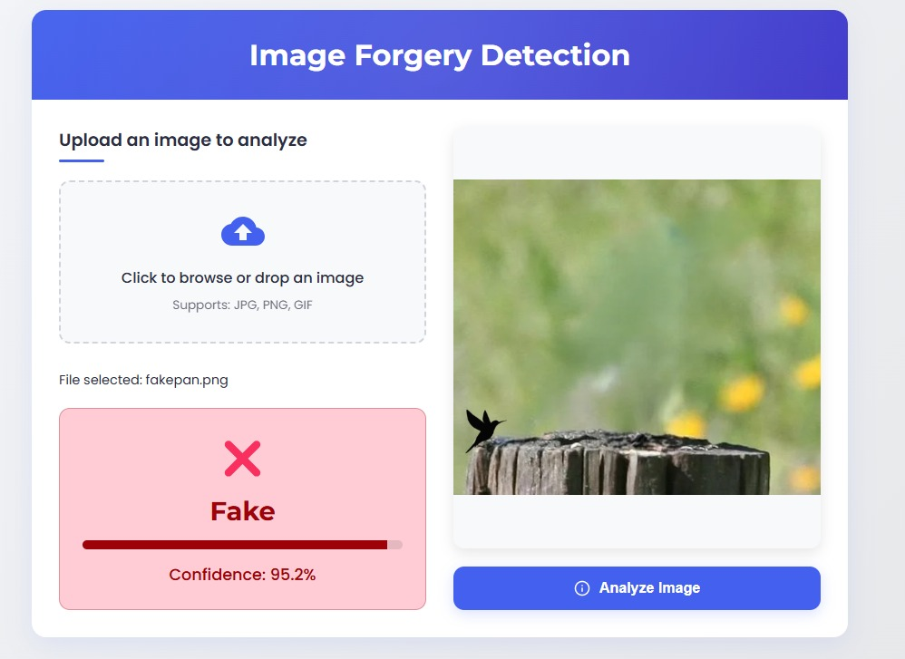

# Image Forgery Detection

A deep learning-based web application that analyzes images to detect potential manipulation or forgery using advanced GAN-based discriminator techniques.

##  Overview

This project provides an easy-to-use web interface for detecting potential image manipulations, forgeries, or AI-generated content. It utilizes a convolutional neural network (CNN) trained to distinguish between authentic and manipulated images.



##  Features

- **Simple Upload Interface**: Drag-and-drop or click to upload images
- **Multiple Format Support**: Analyzes JPEG, PNG, and WebP images
- **Real-time Analysis**: Quick processing and immediate results
- **Confidence Ratings**: Shows confidence level of the detection
- **Detailed Feedback**: Provides specific information about potential manipulations
- **User-friendly UI**: Clean, modern interface with visual indicators

##  Technology Stack

- **Backend**: Flask (Python)
- **ML Framework**: PyTorch
- **Frontend**: HTML, CSS, JavaScript, Bootstrap
- **Model Architecture**: Custom CNN-based discriminator

##  Requirements

- Python 3.7+
- PyTorch 1.7+
- Flask 2.0+
- PIL (Python Imaging Library)

##  Getting Started

### Installation

1. Clone the repository:
   ```bash
   git clone https://github.com/yourusername/image-forgery-detection.git
   cd image-forgery-detection
   ```

2. Install the dependencies:
   ```bash
   pip install -r requirements.txt
   ```

3. Download the pre-trained model:
   - The model file `discriminator_model.pt` should be placed in the root directory.

### Running the Application

```bash
python app.py
```

The application will be available at `http://localhost:5000`

##  How It Works

The system uses a deep convolutional neural network trained as a discriminator in a GAN (Generative Adversarial Network) setup. The discriminator has learned to identify subtle patterns and inconsistencies in manipulated or AI-generated images.

The analysis process:
1. Image is uploaded and preprocessed to 64x64 pixels
2. The GAN model analyzes the image and produces a score
3. Scores are interpreted with custom thresholds:
   - < 0.3: High confidence forgery
   - 0.3-0.45: Likely forgery
   - 0.45-0.55: Uncertain
   - 0.55-0.7: Likely authentic
   - > 0.7: High confidence authentic

##  Training

The discriminator model was trained on a dataset containing both authentic photographs and manipulated/AI-generated images. The training process involved:

1. Dataset preparation with paired authentic/manipulated images
2. GAN training where the discriminator learns to distinguish real from fake
3. Fine-tuning on specific types of manipulations


##  Project Structure

```
IMAGE-FORGERY-PROJECT/
├── forgeryModel/
├── images/
│   └── screenshot.jpg
├── templates/
│   └── index.html
├── app.py
├── discriminator_model.pt
├── README.md
└── requirements.txt
```

##  Limitations

- The model works best on 64x64 pixel images and may be less accurate on higher-resolution details
- Certain sophisticated manipulation techniques might not be detected
- The system is designed as an assistive tool and should not be considered definitive proof of authenticity or manipulation

##  Future Improvements

- Support for higher resolution image analysis
- More detailed analysis of manipulation types
- Localization of manipulated regions within images
- Analysis of metadata and compression artifacts
- Mobile application support

##  License

This project is licensed under the MIT License.

##  Acknowledgements

- [PyTorch](https://pytorch.org/)
- [Flask](https://flask.palletsprojects.com/)
- [Bootstrap](https://getbootstrap.com/)