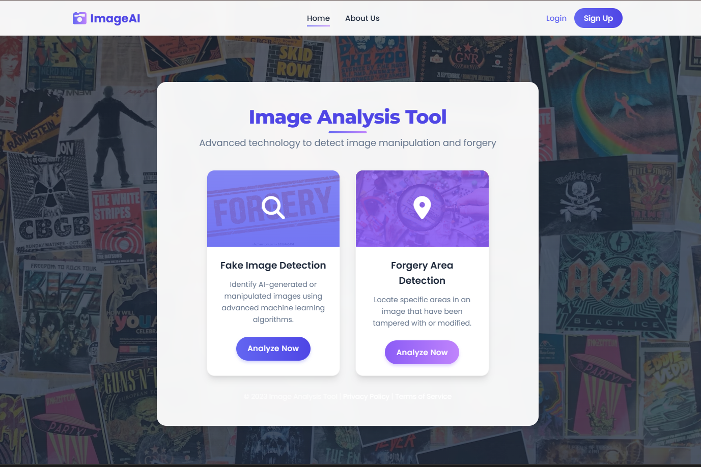

# Image Forgery Detection

## Overview
This project detects forged images using a deep learning-based Discriminator model. It classifies images as authentic or forged by analyzing visual features. The model is trained on a dataset of real and manipulated images and is accessible through a simple Flask web interface.

## Features
- Deep Learning with CNN for forgery detection
- Returns probability of image authenticity
- Supports batch processing of image directories
- Flask-based web interface for easy use
- Categorizes predictions by confidence level

## Project Structure
```
├── model/
│   ├── discriminator.pth          # Pretrained model weights
│   ├── train.py                   # Model training script
├── app/
│   ├── app.py                     # Flask-based API
│   ├── static/                    # Static assets (if any)
├── datasets/
│   ├── real_images/               # Folder containing real images
│   ├── forged_images/             # Folder containing forged images
├── requirements.txt               # Python dependencies
├── README.md                      # Project documentation
```

## Installation

### Prerequisites
- Python 3.8 or later
- pip (Python package manager)

### Install Dependencies
To install the required Python packages, run:
```bash
pip install -r requirements.txt
```

### Download the Pretrained Model
Place the `discriminator.pth` file into the `model/` directory.

## Usage

### Detect Forgery in a Single Image
```python
from utils.inference import detect_image_forgery

result = detect_image_forgery("model/discriminator.pth", "test_image.jpg")
print(result)
```

### Analyze All Images in a Directory
```python
from utils.inference import analyze_directory

results, summary = analyze_directory("model/discriminator.pth", "test_images/")
print(summary)
```

### Run the Flask Web App
To run the web interface:
```bash
python app/app.py
```
Then open [http://127.0.0.1:5000](http://127.0.0.1:5000) in your browser to upload and test images for forgery.

## Model Training (Optional)
If you'd like to train the model on a custom dataset:
```bash
python model/train.py --dataset /path/to/dataset --epochs 10
```

You may modify the training script as needed to fit your dataset structure or augmentations.

## License
This project is licensed under the MIT License. You are free to use, modify, and distribute it.

## Contributing
Contributions are welcome! If you'd like to improve the model, refactor code, or add new features, feel free to fork the repository and submit a pull request.

## Preview

<div align="center">
  
  <p><em>Home screen</em></p>
</div>
